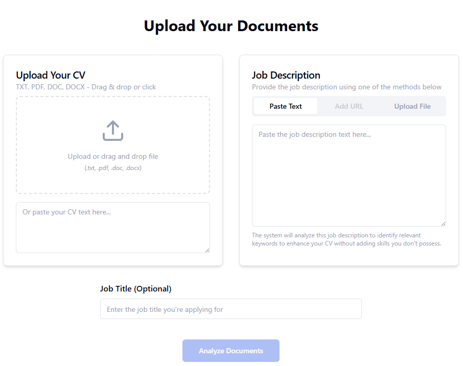
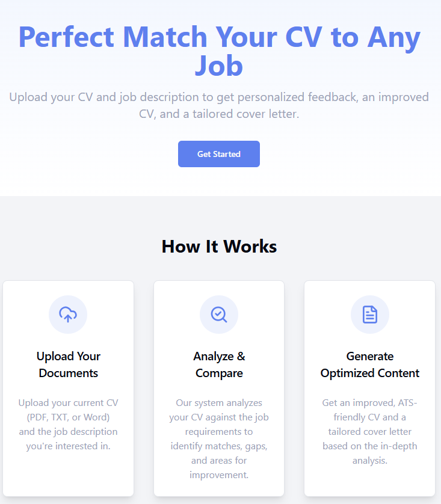

# CV and Cover Letter Wizard

## Introduction

CV and Cover Letter Wizard is a cutting-edge web application designed to help job seekers with their CVs and cover letters. Built with Next.js, it empowers users to effortlessly create, refine, and personalize their CVs and cover letters. This tool leverages advanced AI and natural language processing (NLP) to analyze CVs, generate tailored cover letters, and structure new CVs, all within a seamless and intuitive interface.

**Target Audience:**

This application is tailored for:

*   **Job Seekers:** Individuals actively looking for new job opportunities who need to create or improve their CV and cover letter.
*   **Professionals:** Those who wish to update or improve their CV and cover letter.

## Screenshots

Here are some screenshots to help you visualize the user experience of the app:

### Upload CV and job description

Here is the screen to upload your CV and the job description:

### How it works

Here's how the app will work:

## Key Capabilities

Firebase Studio offers the following core functionalities:

1.  **CV Analysis:**
    *   **Input:** Accepts CVs in PDF format.
    *   **Process:** Analyzes the content, structure, and keywords of the uploaded CV.
    *   **Output:** Provides detailed feedback on areas for improvement and highlights strengths.

2.  **Cover Letter Generation:**
    *   **Input:** Gathers information about the user's experience, target job description, and company details.
    *   **Process:** Utilizes AI and natural language processing (NLP) to craft personalized cover letters.
    *   **Output:** Generates a professional and compelling cover letter tailored to the specific job application.

3.  **CV Generation:**
    *   **Input:** Collects user data such as education, work experience, skills, and projects.
    *   **Process:** Structures the information into a well-formatted and visually appealing CV.
    *   **Output:** Creates a new CV that effectively showcases the user's qualifications and achievements.

## Technologies

CV and Cover Letter Wizard is built on the following technologies:

*   **Next.js:** A React framework for building server-rendered and static web applications.
*   **TypeScript:** A typed superset of JavaScript that enhances code quality and maintainability.
*   **Tailwind CSS:** A utility-first CSS framework for rapidly styling the application.
*   **Radix UI:** An open-source UI component library.
*   **Zod:** Typescript validation schema.
*   **Shadcn-ui:** Reusable UI components
*   **Other dev dependencies:**
    *   "@types/node"
    *   "@types/react"
    *   "@types/react-dom"
    *   "autoprefixer"
    *   "eslint"
    *   "eslint-config-next"
    *   "postcss"
    *   "tailwindcss"

## Style Guidelines

## Installation

To get started with CV and Cover Letter Wizard, follow these steps:

1.  **Clone the Repository:**

The application's style guide is detailed in the [docs/blueprint.md](docs/blueprint.md) file. This document outlines the preferred design patterns, typography, color schemes, and UI element usage.

## Next Steps

The next steps are:

1.  **UI/UX Refinement:**
    *   Enhance the user interface based on the style guide in `docs/blueprint.md`.
    *   Ensure the application is intuitive and visually appealing.
2.  **Firebase Integration:**
3. **CV and Cover letter logic**
    * Implement the main logic for the app.

